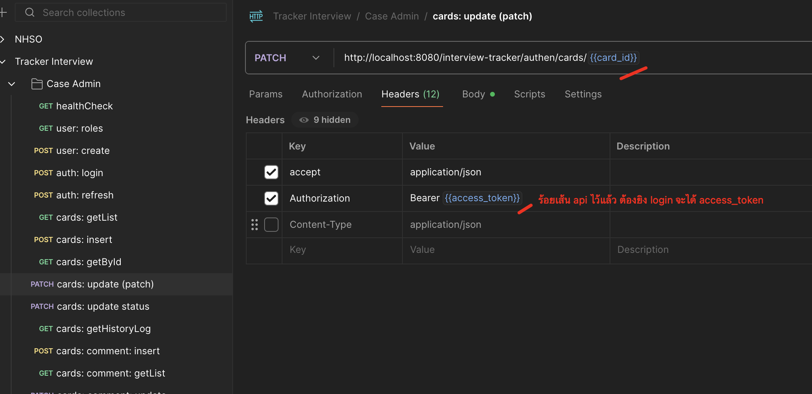
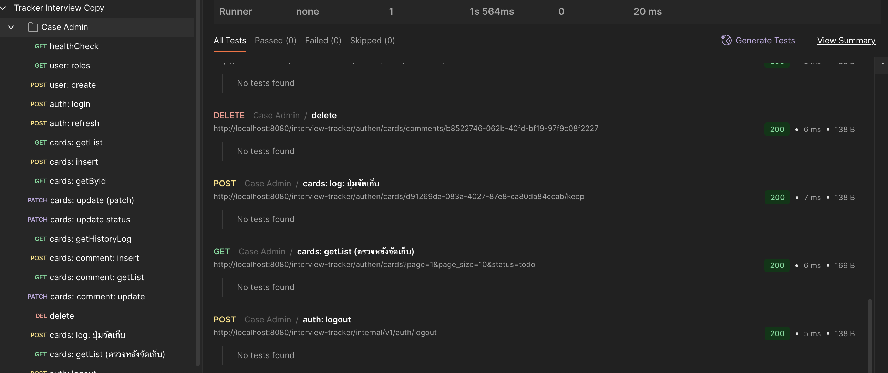

# 📌 Interview Tracker

ระบบ **Interview Tracker** สำหรับจัดการผู้ใช้, สิทธิ์ และการ์ด  
รองรับ Clean Architecture พร้อม Swagger Docs และ Postman Collection สำหรับทดสอบ API ได้ทันที 🚀

---

## 🚀 การรันด้วย Docker Compose
> ต้องติดตั้ง [Docker](https://docs.docker.com/get-docker/) + [Docker Compose](https://docs.docker.com/compose/) ก่อน

```bash
docker-compose up -d
```

### สิ่งที่จะรันขึ้นมา
- 🐘 **Postgres** → Database  
- 🔴 **Redis** → Cache / Rate limit store  
- ⚙️ **Interview Tracker API** → Go service  

### ตรวจสอบ Health Check
```bash
curl http://localhost:8080/interview-tracker/health
# "success"
```

---

## 💻 การใช้งานตอน Dev
เราเตรียม **Makefile** ไว้ให้แล้ว 🎉

### คำสั่งที่ใช้บ่อย
```bash
make up          # เพื่อรัน docker (db, redis, api)
make swagger-up  # เพื่อ update swagger docs (gen ใหม่ + reService auto)
make mock-repo   # เพื่อ generate mock repository สำหรับ unit test
```

### 🔄 Hot Reload (Air)
- Dev service ผูกกับ **Air**  
- เมื่อแก้โค้ด → จะ **reload service อัตโนมัติ** (ไม่ต้อง stop/start เอง)  
- กรณี `make swagger-up` → จะ gen swagger ใหม่ แล้ว Air จะ reService ให้ทันที  

---

## 📬 Postman Collection
เรามี **Postman Collection** รวมทุกเส้น API ไว้แล้ว ✨  

- สามารถกด **Run Collection** ได้ทีเดียว → จะยิง API ครบ flow และต้องผ่านทั้งหมด (success)  

ไฟล์อยู่ที่:  
```
Tracker_Interview.postman_collection.json
```


---

## 🛠️ Tech Stack
- Go 1.23 (Gin + Clean Architecture)  
- PostgreSQL 14  
- Redis 7  
- Docker + Docker Compose  
- Swagger / Postman  
- Air (hot reload)  
- Mockery (สำหรับ mock repo ใน unit test)  

---

## 🦎 Swagger
```bash
http://localhost:8080/interview-tracker/swagger/index.html
```

---

✨ พร้อมใช้งานแล้วค่ะ 🎉
